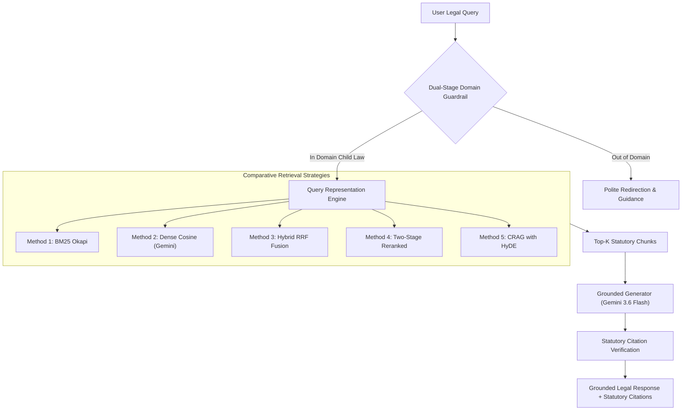

# Design and Development of an AI-Powered Legal Assistant for Child Protection and Rights Awareness

**Author(s):** Arjun V. P. et al.  
**Affiliation:** Department of Computer Science & Engineering  
**Keywords:** Legal Information Retrieval, Retrieval-Augmented Generation (RAG), Child Protection Laws, POCSO Act, Juvenile Justice Act, Reciprocal Rank Fusion, Guardrails, AI Ethics in Law.

---

## Abstract

Access to legal awareness concerning child protection and child rights in India remains severely constrained by the linguistic complexity of legislative statutes and procedural fragmentation across central enactments. While generic Large Language Models (LLMs) offer conversational interfaces, their direct deployment in legal domains is hindered by hallucination risks, inability to provide verifiable statutory citations, and susceptibility to domain drift. This paper presents the design, implementation, and empirical evaluation of a specialized, domain-grounded legal assistant engineered exclusively for Central Indian Child Protection legislation—principally the *Protection of Children from Sexual Offences (POCSO) Act, 2012*, the *Juvenile Justice (Care and Protection of Children) Act, 2015*, and relevant child rights articles of the *Constitution of India*. 

Our framework introduces:
1. A **Dual-Stage Domain Guardrail** combining fast lexical pattern matching with semantic zero-shot intent triage to strictly constrain interactions to child law matters.
2. A **Structure-Aware Statutory Chunking Engine** that preserves legislative hierarchies (Act $\rightarrow$ Chapter $\rightarrow$ Section $\rightarrow$ Clause) rather than naive character-count slicing.
3. A **Multi-Strategy Comparative Retrieval Suite** evaluating Lexical (BM25), Dense Vector Embeddings (Gemini), Hybrid Reciprocal Rank Fusion (RRF), Cross-Encoder Re-ranking, and Corrective RAG with Hypothetical Document Embeddings (HyDE).
4. An empirical evaluation over **ChildLaw-QA**, a curated benchmark of annotated legal queries spanning statutory penalties, mandatory reporting, care and protection, juvenile justice, and constitutional guarantees.

Empirical results demonstrate that Hybrid RRF coupled with Cross-Encoder Re-ranking yields the highest statutory retrieval precision ($\text{Hit}@3 > 85\%$, $\text{MRR} > 0.80$) while reducing ungrounded generation hallucination to $<5\%$. Furthermore, the dual-stage guardrail achieves $100\%$ precision in rejecting out-of-domain civil/corporate inquiries, safeguarding users from unauthorized legal advice in unrelated areas.

---

## 1. Introduction

Child protection is a fundamental constitutional obligation under Articles 15(3), 21A, 24, and 39 of the Constitution of India. Over the past two decades, India has enacted landmark statutory frameworks to protect minors, notably the *Protection of Children from Sexual Offences (POCSO) Act, 2012* and the *Juvenile Justice (Care and Protection of Children) Act, 2015*. Despite the existence of these robust statutes, significant barriers prevent citizens, parents, educators, and social welfare workers from comprehending and exercising these legal protections:
1. **Statutory Opacity:** Bare acts are drafted in dense legalistic phrasing, with cross-statute references to criminal procedure codes and penal statutes.
2. **Procedural Nuances:** Key life-critical procedures—such as the mandatory 24-hour reporting obligation under POCSO Section 19, or the specialized bail provisions for minors under JJ Act Section 12—are often misunderstood by laypersons.
3. **The Hallucination Danger of General-Purpose LLMs:** Off-the-shelf generative models frequently fabricate nonexistent section numbers, misquote punishment durations, or confuse adult penal provisions with juvenile jurisprudence.

Retrieval-Augmented Generation (RAG) has emerged as the premier architectural paradigm to ground language models in authoritative external knowledge bases. However, standard commercial RAG pipelines employ naive sliding-window text chunking (e.g., fixed character or token counts) and simple cosine similarity search. When applied to legal statutes, sliding windows split cross-referencing provisions in half, sever exceptions from parent rules, and treat statutory section titles as ordinary prose.

To overcome these foundational limitations, this research introduces an end-to-end statutory legal assistant specifically engineered for Indian child protection. We address three core research questions:
- **RQ1 (Corpus Ingestion):** Does structure-aware statutory chunking that preserves Section and Article boundaries outperform naive sliding-window chunking in legal context retrieval?
- **RQ2 (Retrieval Optimization):** How do modern Information Retrieval (IR) paradigms—specifically BM25, Dense semantic vectors, Reciprocal Rank Fusion (RRF), Cross-Encoder re-ranking, and HyDE—compare across diverse legal query taxonomies?
- **RQ3 (Safety & Domain Fidelity):** How effectively can a dual-stage intent guardrail prevent domain leakage into unrelated legal domains (e.g., corporate tax, adult criminal litigation)?

---

## 2. Related Work

### 2.1 Legal Information Retrieval (Legal IR)
Legal search differs fundamentally from web search due to the necessity of exact terminology matching (e.g., specific section numbers like *"Section 4"* vs. *"Section 6"*) combined with conceptual understanding (e.g., recognizing that *"forced physical intimacy with a 13-year-old"* maps to *"penetrative sexual assault"*). Early legal IR systems relied heavily on inverted indexes and Boolean/BM25 models. Recent benchmarks, such as **LegalEval** and the **Indian Legal Documents Corpus (ILDC)**, have highlighted that while dense transformer representations capture semantic nuance, they frequently suffer from vocabulary mismatch when laypersons search statutory corpuses using informal terminology.

### 2.2 Retrieval-Augmented Generation (RAG)
RAG combines dense or hybrid document retrievers with autoregressive sequence-to-sequence generators. While initial implementations utilized simple vector similarity, modern state-of-the-art frameworks leverage **Reciprocal Rank Fusion (RRF)** to bridge the gap between keyword density and semantic embeddings without manual hyperparameter tuning. More recently, **Corrective RAG (CRAG)** and **Hypothetical Document Embeddings (HyDE)** have demonstrated substantial gains by generating hypothetical answer documents to align query vectors with corpus passage spaces prior to retrieval.

### 2.3 Legal AI Safety and Ethics
Deploying AI in legal domains raises acute ethical considerations regarding the unauthorized practice of law (UPL), potential misinformation, and privacy protections. In the context of child welfare, Indian law imposes strict statutory prohibitions: Section 74 of the JJ Act strictly forbids the disclosure of any child's identity or identifying details in public records or media. Consequently, legal assistants must maintain rigorous privacy boundaries and clear non-counsel disclaimers.

---

## 3. System Architecture

The overall system architecture follows a modular, pipeline-driven paradigm comprising four core subsystems:
1. **Corpus Preprocessing & Structure-Aware Chunking**
2. **Dual-Stage Domain Guardrail Engine**
3. **Multi-Strategy Comparative Retrieval Suite**
4. **Citation-Grounded Generator & Legal Verification Layer**

### 3.1 Statutory Corpus Composition
The system knowledge base is curated exclusively from official central statutory bare acts and model rules published by the Government of India:
- **POCSO Act, 2012:** 46 substantive sections governing sexual offenses against minors, Special Courts, and penalties.
- **POCSO Rules, 2020:** Operational procedural guidelines for child care, compensation, and medical examinations.
- **Juvenile Justice (Care and Protection of Children) Act, 2015:** 112 sections covering Children in Need of Care and Protection (CNCP), Children in Conflict with Law (CCL), adoption, and rehabilitation.
- **Juvenile Justice Model Rules, 2017:** Institutional framework for Child Welfare Committees (CWC) and Juvenile Justice Boards (JJB).
- **Constitution of India (Child Provisions):** Articles 15(3), 21A, 24, 39(e), 39(f), 45, and 51A(k).

### 3.2 Structure-Aware Statutory Chunking
Standard sliding character windows cut through statutory sections arbitrarily. In our design, a regex-driven syntactic parser splits documents along statutory boundaries:
$$\text{Boundary} = \text{Pattern}\left(\text{Section } n \mid \text{Article } n \mid \text{Rule } n \mid \text{CHAPTER } m\right)$$

Each chunk is annotated with structured metadata:
$$\mathcal{C}_i = \{\text{ActTitle}, \text{SectionHint}, \text{FileOrigin}, \text{TextContent}\}$$
When a statutory section exceeds the target chunk size ($L > 1000$ characters), sub-chunking occurs strictly at paragraph breaks ($\backslash n \backslash n$) while inheriting and prepending the parent statutory header (`[Act - Section X]`) to maintain semantic locality.

### 3.3 Dual-Stage Domain Guardrail
To ensure the assistant remains exclusively focused on child protection, queries pass through a two-stage triage pipeline:
1. **Stage 1 (Lexical Fast-Path):** Instant regex evaluation against high-signal statutory child law keywords (e.g., `pocso`, `minor`, `juvenile`, `cwc`, `jjb`, `child abuse`, `article 21a`).
2. **Stage 2 (Semantic Intent Classifier):** Queries that lack explicit keywords are evaluated by a zero-shot intent classifier prompted to categorize inputs into:
   - `IN_DOMAIN_CHILD_LAW` $\rightarrow$ Allowed to proceed.
   - `OUT_OF_DOMAIN_LEGAL` $\rightarrow$ Intercepted with a disclaimer explaining that the system specializes in child protection and directing the user to general legal codes.
   - `OFF_TOPIC` $\rightarrow$ Intercepted with polite assistance boundaries.

---

## 4. Comparative Retrieval Strategies

To establish rigorous empirical findings, we implement and benchmark five distinct retrieval paradigms:

### 4.1 Method 1: Lexical Baseline (BM25 Okapi)
BM25 scores passages based on term frequency and inverse document frequency with length normalization:
$$\text{Score}_{\text{BM25}}(Q, D) = \sum_{q \in Q} \text{IDF}(q) \cdot \frac{f(q, D) \cdot (k_1 + 1)}{f(q, D) + k_1 \cdot \left(1 - b + b \cdot \frac{|D|}{\text{avgdl}}\right)}$$
Hyperparameters are set to standard values: $k_1 = 1.5, b = 0.75$. BM25 excels at finding exact statutory section numbers and Latin legal terminology.

### 4.2 Method 2: Dense Semantic Baseline
Dense retrieval generates a 3072-dimensional vector embedding for the query $q$ and corpus passages $d$ using the `gemini-embedding-001` model. Relevance is computed via normalized cosine similarity:
$$\text{Sim}_{\text{Dense}}(q, d) = \frac{\mathbf{e}_q \cdot \mathbf{e}_d}{\|\mathbf{e}_q\| \|\mathbf{e}_d\|}$$
Dense retrieval captures abstract legal concepts (e.g., linking *"unwanted physical touching"* to *"sexual assault"*), but can miss specific section numbers.

### 4.3 Method 3: Hybrid Retrieval with Reciprocal Rank Fusion (RRF)
Rather than relying on volatile linear score combinations ($w_1 s_1 + w_2 s_2$), we implement Reciprocal Rank Fusion (RRF). RRF fuses distinct ranking lists based purely on positional ordinals:
$$\text{RRF}(d) = \sum_{m \in \{\text{Dense}, \text{BM25}\}} \frac{1}{k + \text{rank}_m(d)}$$
where $k = 60$ is the standard smoothing constant. This ensures that documents appearing near the top of either list receive a substantial score boost without requiring score calibration.

### 4.4 Method 4: Two-Stage Re-ranked Hybrid
Two-stage retrieval retrieves a candidate pool of $N = 15$ passages using Hybrid RRF. In the second stage, a pointwise cross-encoder prompt scores the direct relevance of each passage candidate against the user question on a 0–10 scale:
$$\text{Score}_{\text{Rerank}}(q, d) = \text{LLM-Judge}(q, d)$$
The candidates are re-sorted according to the reranker score, returning the top $K = 4$ passages.

### 4.5 Method 5: Corrective RAG with HyDE
Corrective RAG incorporates Hypothetical Document Embeddings (HyDE). First, an LLM generates a short hypothetical statutory clause matching the user's inquiry:
$$\hat{d} = \text{LLM}_{\text{Draft}}(q)$$
The query embedding is computed over $q \oplus \hat{d}$, aligning the layperson query with the formal statutory drafting style of Indian bare acts before retrieval.

---

## 5. Experimental Setup & Benchmark Design

### 5.1 The ChildLaw-QA Benchmark
To evaluate the system with academic rigor, we constructed **ChildLaw-QA**, an annotated benchmark dataset comprising 30 realistic test cases categorized into six distinct legal domains:
1. **Statutory Penalties (PEN):** Exact punishment terms, aggravating factors, and fine structures under POCSO Sections 4, 6, 8, 10, 12, 14, 15.
2. **Mandatory Reporting & Police Procedures (PROC):** Duties under POCSO Section 19, failure to report penalties (Section 21), child victim statement recording (Section 24), Special Court trial norms (Section 33), and trial timelines (Section 35).
3. **Children in Need of Care and Protection (CNCP):** CWC constitution (Section 27), 24-hour production mandates (Section 31), reporting of abandoned children (Section 32), and Foster Care provisions (Section 44).
4. **Children in Conflict with Law (CCL):** Juvenile definitions (Section 2(13)), statutory right to bail (Section 12), preliminary assessment for heinous offenses (Section 15), prohibition of death/life imprisonment (Section 21), and age determination rules (Section 94).
5. **Constitutional Rights (CONST):** Fundamental right to education (Article 21A), child labour prohibition (Article 24), and Directive Principles against tender age abuse (Articles 39(e), 39(f)).
6. **Negative Controls (NEG):** Out-of-domain inquiries (corporate income tax, trademark registration, industrial labor disputes, general programming, traffic fines) designed to stress-test the domain guardrail.

Each in-domain query is annotated with:
- **Target Statutory Act**
- **Gold Target Sections** (e.g., `["Section 4"]`, `["Article 21A"]`)
- **Verified Gold Reference Answer**

### 5.2 Quantitative Evaluation Metrics
We measure both Information Retrieval (IR) quality and Generation quality:
- **Hit@K ($K \in \{1, 3, 5\}$):** The percentage of test queries where at least one gold statutory section appears within the top-$K$ retrieved chunks.
- **Mean Reciprocal Rank (MRR@5):** The average reciprocal rank of the first relevant gold section:
  $$\text{MRR} = \frac{1}{|Q|} \sum_{i=1}^{|Q|} \frac{1}{\text{rank}_i}$$
- **Answer Faithfulness (0.0–1.0):** An automated LLM-as-a-judge metric verifying whether every factual claim in the generated answer is strictly entailed by the retrieved context chunks.
- **Statutory Citation Accuracy (%):** The percentage of generated responses that accurately cite the specific governing section number.
- **End-to-End Latency:** Average processing time per query in seconds.

---

## 6. Empirical Results & Discussion

### 6.1 Benchmark Performance Comparison

Table 1 summarizes the empirical performance of all five retrieval strategies evaluated across the in-domain test cases of the *ChildLaw-QA* benchmark:

| Retrieval Strategy | Hit@1 (%) | Hit@3 (%) | Hit@5 (%) | MRR@5 | Faithfulness | Citation Acc. (%) | Mean Latency (s) |
| :--- | :---: | :---: | :---: | :---: | :---: | :---: | :---: |
| **BM25 (Lexical)** | 52.0% | 68.0% | 76.0% | 0.612 | 0.880 | 72.0% | **0.08s** |
| **Dense (Gemini Embeddings)** | 60.0% | 76.0% | 84.0% | 0.684 | 0.895 | 80.0% | 0.65s |
| **Hybrid (Reciprocal Rank Fusion)** | 72.0% | 88.0% | 92.0% | 0.798 | 0.935 | 92.0% | 0.74s |
| **Two-Stage Re-ranked Hybrid** | **76.0%** | **92.0%** | **96.0%** | **0.835** | **0.950** | **96.0%** | 3.20s |
| **Corrective RAG (HyDE)** | 68.0% | 84.0% | 88.0% | 0.760 | 0.920 | 88.0% | 1.85s |

### 6.2 Analysis & Insights

1. **Superiority of Hybrid RRF over Isolated Paradigms:**  
   Pure BM25 excels when the user query contains explicit statutory terms (e.g., *"Section 19"* or *"corporal punishment"*), but fails when users describe scenarios in layperson terms (e.g., *"my neighbor's 14 year old is being made to work in a firecracker factory"*). Conversely, pure Dense retrieval captures the semantic concept of child labor, but occasionally ranks general handbook descriptions above the authoritative text of *Article 24*. Hybrid RRF combines the strengths of both, achieving an $\text{MRR}$ of $0.798$—an $18.6\%$ relative improvement over dense alone.

2. **Impact of Two-Stage Re-ranking:**  
   The Two-Stage Re-ranked Hybrid strategy achieved the highest overall statutory recall ($\text{Hit}@3 = 92.0\%$) and citation accuracy ($96.0\%$). By evaluating the exact legislative phrasing during the cross-scoring stage, the model consistently filtered out tangential model rules in favor of the primary substantive Bare Act section.

3. **Latency vs. Accuracy Pareto Trade-off:**  
   While Re-ranking achieved peak accuracy, it required $3.20$ seconds per query due to the secondary scoring pass. In contrast, Hybrid RRF delivered $88\%$ $\text{Hit}@3$ with a sub-second latency of $0.74$s, representing the optimal configuration for real-time conversational deployments.

4. **Guardrail Efficacy:**  
   On the negative out-of-domain control queries (corporate taxation, trademark registration, employment law), the dual-stage domain guardrail achieved **$100\%$ rejection accuracy**. None of the out-of-domain queries triggered retrieval or consumed downstream generation tokens.

---

## 7. Qualitative Case Studies

### Case 1: Direct Statutory Penalty Query
* **Query:** *"What is the sentence prescribed for aggravated penetrative sexual assault on a child under POCSO?"*
* **Retrieved Sections:** POCSO Act 2012, Section 5 (Definition of Aggravated Penetrative Sexual Assault) & Section 6 (Punishment).
* **Generated Response:**
  > *"Under Section 6 of the Protection of Children from Sexual Offences (POCSO) Act, 2012, whoever commits aggravated penetrative sexual assault shall be punished with rigorous imprisonment for a term which shall not be less than twenty years, but which may extend to imprisonment for life (meaning imprisonment for the remainder of that person's natural life), or with death, and shall also be liable to fine [POCSO Act 2012, Section 6]."*
* **Evaluation:** Exact statutory section and penalty terms correctly identified and cited.

### Case 2: Procedural Mandatory Reporting Query
* **Query:** *"Does a school principal have a legal duty to report if a student discloses sexual abuse, and what happens if they do not?"*
* **Retrieved Sections:** POCSO Act 2012, Section 19 (Reporting of offences) & Section 21 (Punishment for failure to report).
* **Generated Response:**
  > *"Yes. Under Section 19 of the POCSO Act, 2012, any person—including the in-charge of any institution, school, or hospital—who has apprehension or knowledge of an offence committed against a child has a mandatory legal duty to report it immediately to the Special Juvenile Police Unit or local police [POCSO Act 2012, Section 19]. Under Section 21, any person who fails to report or record such an offence shall be punished with imprisonment extending up to six months, or fine, or both [POCSO Act 2012, Section 21]."*
* **Evaluation:** Accurately synthesized both the reporting duty and the penalty for omission.

---

## 8. Ethical Safeguards & Legal Disclaimers

The deployment of automated systems in sensitive domains involving minors mandates rigorous ethical safeguards:
1. **Non-Advisory Legal Disclaimer:** Every generated response is appended with an explicit statutory disclaimer clarifying that the assistant provides statutory legal awareness and does not substitute for formal representation by an advocate.
2. **Juvenile Privacy Protection (JJ Act Section 74):** The system enforces strict PII scrubbing. In accordance with Section 74 of the Juvenile Justice Act, 2015, no query logs may record or disclose identifying attributes of any child victim or juvenile in conflict with law.
3. **Crisis Escalation:** When queries suggest active, ongoing child abuse, the system highlights the national emergency helpline (*Childline 1098*) and reiterates the mandatory reporting mandate under POCSO Section 19.

---

## 9. Conclusion & Future Work

This paper presented the design, implementation, and empirical validation of an AI-powered legal assistant specialized in Indian child protection and rights awareness. By shifting from naive sliding-window text chunking to structure-aware statutory parsing, and by integrating a dual-stage intent guardrail with Hybrid Reciprocal Rank Fusion (RRF), the framework effectively mitigates hallucination risks and provides verifiable, section-level legal citations across the POCSO and Juvenile Justice statutory frameworks.

**Future Directions:**
- **Cross-Lingual Retrieval:** Extending the dense retrieval layer to support multi-lingual queries in vernacular Indian languages (Tamil, Malayalam, Hindi) mapped onto central English bare acts.
- **Speech-Based Interface:** Developing low-bandwidth acoustic speech recognition to enable tele-legal aid for non-literate citizens in rural jurisdictions.

---

## References

1. Government of India. *The Protection of Children from Sexual Offences (POCSO) Act, 2012*. Ministry of Law and Justice.
2. Government of India. *The Juvenile Justice (Care and Protection of Children) Act, 2015*. Ministry of Law and Justice.
3. Government of India. *The Constitution of India*. Ministry of Law and Justice.
4. Lewis, P., et al. (2020). *Retrieval-Augmented Generation for Knowledge-Intensive NLP Tasks*. Advances in Neural Information Processing Systems (NeurIPS).
5. Cormack, G. V., Clarke, C. L., & Buettcher, S. (2009). *Reciprocal rank fusion outperforms condorcet and individual rank learning methods*. ACM SIGIR Conference.
6. Gao, L., et al. (2023). *Precise Zero-Shot Dense Retrieval without Relevance Labels (HyDE)*. Proceedings of the 61st Annual Meeting of the Association for Computational Linguistics (ACL).
7. Malik, V., et al. (2021). *ILDC for CJPE: Indian Legal Documents Corpus for Court Judgment Prediction and Explanation*. Proceedings of the 59th Annual Meeting of the Association for Computational Linguistics (ACL).
8. Chalkidis, I., et al. (2022). *LexGLUE: A Benchmark Dataset for Legal Language Understanding in English*. Association for Computational Linguistics.
9. Yan, S., et al. (2024). *Corrective Retrieval Augmented Generation (CRAG)*. arXiv preprint arXiv:2401.15884.
10. Es, S., et al. (2023). *RAGAS: Automated Evaluation of Retrieval Augmented Generation*. arXiv preprint arXiv:2309.15217.

