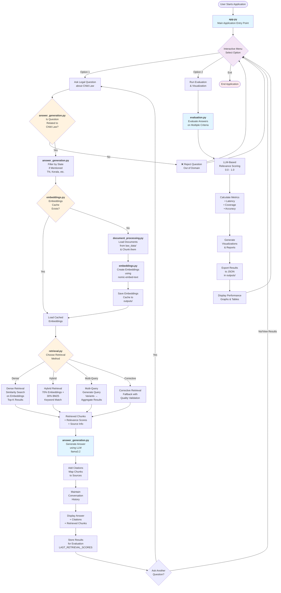

```mermaid
graph TD
    Start([User Starts Application]) --> MainApp["<b>app.py</b><br/>Main Application Entry Point"]
    
    MainApp --> Menu{"Interactive Menu<br/>Select Option"}
    
    Menu -->|Option 1| AskQuestion["Ask Legal Question<br/>about Child Law"]
    Menu -->|Option 2| Evaluation["Run Evaluation<br/>& Visualization"]
    Menu -->|Exit| End([End Application])
    
    AskQuestion --> ValidateDomain{"<b>answer_generation.py</b><br/>Is Question<br/>Related to<br/>Child Law?"}
    
    ValidateDomain -->|No| Reject["❌ Reject Question<br/>Out of Domain"]
    Reject --> Menu
    
    ValidateDomain -->|Yes| StateFilter["<b>answer_generation.py</b><br/>Filter by State<br/>if Mentioned<br/>TN, Kerala, etc."]
    
    StateFilter --> CheckCache{"<b>embeddings.py</b><br/>Embeddings<br/>Cache<br/>Exists?"}
    
    CheckCache -->|Yes| LoadCache["Load Cached<br/>Embeddings"]
    CheckCache -->|No| ProcessDocs["<b>document_processing.py</b><br/>Load Documents<br/>from law_data/<br/>& Chunk them"]
    
    ProcessDocs --> CreateEmbed["<b>embeddings.py</b><br/>Create Embeddings<br/>using<br/>nomic-embed-text"]
    CreateEmbed --> SaveCache["Save Embeddings<br/>Cache to<br/>outputs/"]
    SaveCache --> LoadCache
    
    LoadCache --> RetMethod{"<b>retrieval.py</b><br/>Choose Retrieval<br/>Method"}
    
    RetMethod -->|Dense| Dense["Dense Retrieval<br/>Similarity Search<br/>on Embeddings<br/>Top-K Results"]
    
    RetMethod -->|Hybrid| Hybrid["Hybrid Retrieval<br/>70% Embeddings +<br/>30% BM25<br/>Keyword Match"]
    
    RetMethod -->|Multi-Query| MultiQ["Multi-Query<br/>Generate Query<br/>Variants →<br/>Aggregate Results"]
    
    RetMethod -->|Corrective| Correct["Corrective Retrieval<br/>Fallback with<br/>Quality Validation"]
    
    Dense --> Retrieved["Retrieved Chunks<br/>+ Relevance Scores<br/>+ Source Info"]
    Hybrid --> Retrieved
    MultiQ --> Retrieved
    Correct --> Retrieved
    
    Retrieved --> GenAnswer["<b>answer_generation.py</b><br/>Generate Answer<br/>using LLM<br/>llama3.2"]
    
    GenAnswer --> AddCitations["Add Citations<br/>Map Chunks<br/>to Sources"]
    
    AddCitations --> MaintainHistory["Maintain<br/>Conversation<br/>History"]
    
    MaintainHistory --> DisplayResult["Display Answer<br/>+ Citations<br/>+ Retrieved Chunks"]
    
    DisplayResult --> StoreForEval["Store Results<br/>for Evaluation<br/>LAST_RETRIEVAL_SCORES"]
    
    StoreForEval --> MoreQuestions{"Ask Another<br/>Question?"}
    
    MoreQuestions -->|Yes| AskQuestion
    MoreQuestions -->|No/View Results| Menu
    
    Evaluation --> EvalProcess["<b>evaluation.py</b><br/>Evaluate Answers<br/>on Multiple Criteria"]
    
    EvalProcess --> RelevanceScore["LLM-Based<br/>Relevance Scoring<br/>0.0 - 1.0"]
    
    RelevanceScore --> MetricsCalc["Calculate Metrics<br/>• Latency<br/>• Coverage<br/>• Accuracy"]
    
    MetricsCalc --> Visualize["Generate<br/>Visualizations<br/>& Reports"]
    
    Visualize --> ExportResults["Export Results<br/>to JSON<br/>in outputs/"]
    
    ExportResults --> DisplayMetrics["Display Performance<br/>Graphs & Tables"]
    
    DisplayMetrics --> Menu
    
    Reject --> Menu
    
    style MainApp fill:#e1f5ff
    style ValidateDomain fill:#fff3e0
    style CheckCache fill:#fff3e0
    style RetMethod fill:#fff3e0
    style GenAnswer fill:#e1f5ff
    style EvalProcess fill:#e1f5ff
    style Menu fill:#f3e5f5
    style End fill:#ffebee
```