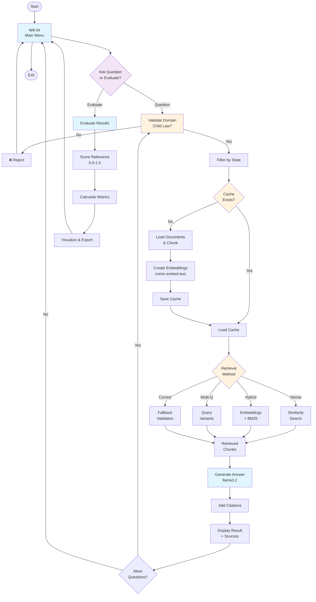

```mermaid
graph TD
    A([Start]) --> B["app.py<br/>Main Menu"]
    B --> C{Ask Question<br/>or Evaluate?}
    
    C -->|Question| D["Validate Domain<br/>Child Law?"]
    D -->|No| E["❌ Reject"]
    E --> B
    D -->|Yes| F["Filter by State"]
    
    F --> G{Cache<br/>Exists?}
    G -->|No| H["Load Documents<br/>& Chunk"]
    H --> I["Create Embeddings<br/>nomic-embed-text"]
    I --> J["Save Cache"]
    G -->|Yes| K["Load Cache"]
    J --> K
    
    K --> L{Retrieval<br/>Method}
    L -->|Dense| M["Similarity<br/>Search"]
    L -->|Hybrid| N["Embeddings<br/>+ BM25"]
    L -->|Multi-Q| O["Query<br/>Variants"]
    L -->|Correct| P["Fallback<br/>Validation"]
    
    M --> Q["Retrieved<br/>Chunks"]
    N --> Q
    O --> Q
    P --> Q
    
    Q --> R["Generate Answer<br/>llama3.2"]
    R --> S["Add Citations"]
    S --> T["Display Result<br/>+ Sources"]
    T --> U{More<br/>Questions?}
    U -->|Yes| D
    U -->|No| B
    
    C -->|Evaluate| V["Evaluate Results"]
    V --> W["Score Relevance<br/>0.0-1.0"]
    W --> X["Calculate Metrics"]
    X --> Y["Visualize & Export"]
    Y --> B
    
    B --> Z([Exit])
    
    style B fill:#e1f5ff
    style D fill:#fff3e0
    style L fill:#fff3e0
    style G fill:#fff3e0
    style R fill:#e1f5ff
    style V fill:#e1f5ff
    style C fill:#f3e5f5
```